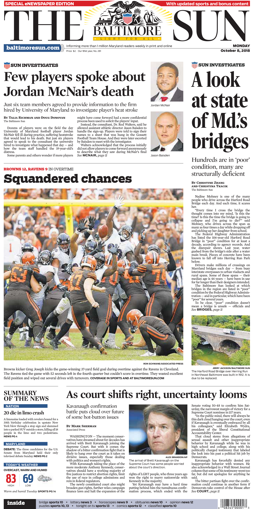

# Maryland bridges analysis

By [Christine Zhang](mailto:czhang@baltsun.com)

The Baltimore Sun conducted an analysis of bridge conditions in the state, with a focus on bridges in the Baltimore area. The Sun looked at which bridges were listed in "poor" condition by the Federal Highway Administration (FHA) — and in particular, which have been "poor" for several years.

The results were reported in a October, 8, 2018 Baltimore Sun story titled ["How safe are Maryland's bridges?"](http://www.baltimoresun.com/news/maryland/bs-md-bridge-collapse-maryland-20180815-story.html) (print headline: "A look at state of Md.'s bridges.")

The Sun's findings and analysis are available in the "analysis" notebook in this repository, [`02_analysis.ipynb`](https://github.com/baltimore-sun-data/bridge-data/blob/master/02_analysis.ipynb) (note: viewable on desktop).

https://twitter.com/baltsundata

